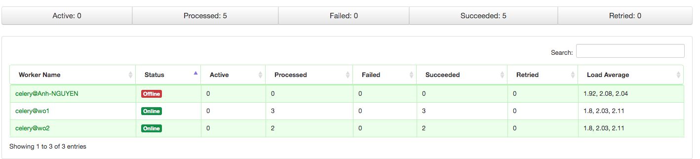
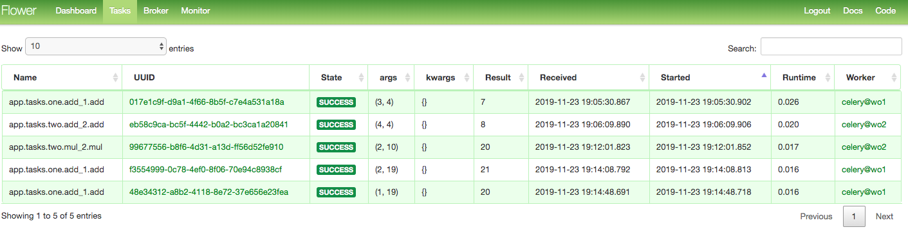

## Start Broker Redis
```
redis-server
```
## Start 2 worker: w1, w2

```
celery -A app.celery worker -n wo1 --loglevel=INFO -Q w1
```
- on other terminal
```
celery -A app.celery worker -n wo2 --loglevel=INFO -Q w2
```

## run flower monitoring
```
celery flower -A app.celery --loglevel=INFO
```

- go on `localhost:5555`

## Start application

```
python manage.py run
```



